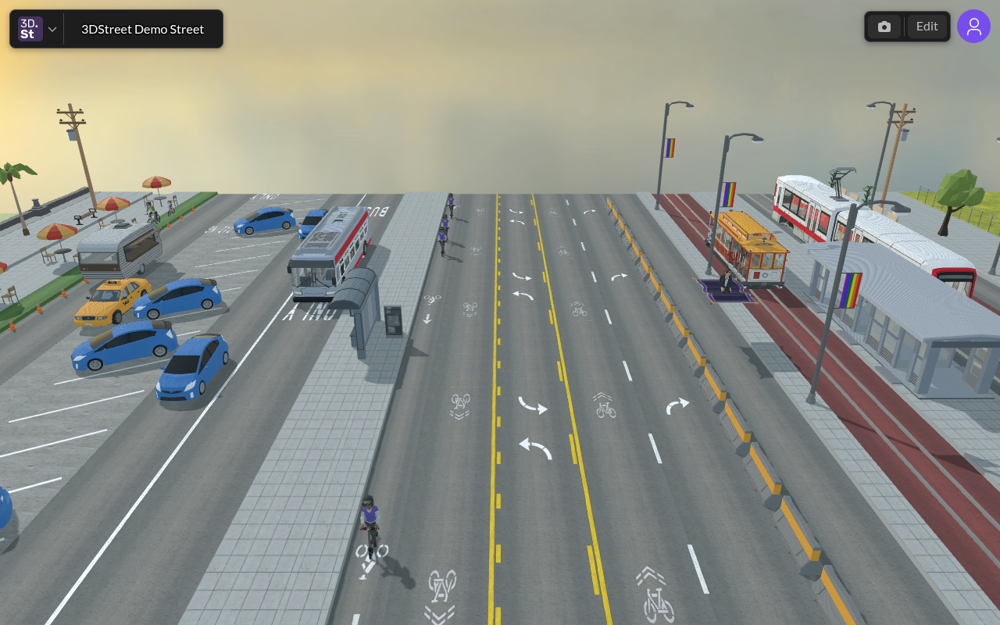

# 3DStreet × Folk Computer

Show a 3DStreet scene on a [Folk Computer](https://github.com/FolkComputer/folk)
table — the "ghetto ASAP" open-house version.


_An actual frame produced by `capture-3dstreet.mjs` — headless Chrome,
software WebGL, no GPU._

## How it works

The bridge between 3DStreet (a browser app) and Folk (a projector/camera Tcl
system with no browser) is **a PNG over HTTP**:

```
laptop: headless Chrome renders 3dstreet.app in viewer mode ──▶ shots/3dstreet.png
laptop: python3 -m http.server 8000 serves the folder
folk:   Wish $this displays image "http://laptop:8000/3dstreet.png"
```

Two Folk facts make this nearly free:

1. Folk's builtin image loader (`builtin-programs/draw/image.folk`) accepts an
   `http(s)://` URL directly — it curls the file to `/tmp` and projects it onto
   the program's page region.
2. It **caches by exact URL**, so a live feed just re-claims the URL with a
   fresh `?t=` cache-buster (the loop-plus-`Hold!` pattern used by Folk's own
   `builtin-programs/fswatch.folk`).

## Tier 0 — static image, one line of Tcl (~2 minutes)

No laptop bridge needed. Put any PNG render of a scene somewhere reachable
(or in `~/folk-images/` on the Folk machine) and print/run:

```tcl
Wish $this displays image "http://YOUR-LAPTOP-IP:8000/3dstreet.png"
```

That is the whole program — see [`3dstreet-display.folk`](3dstreet-display.folk).

## Tier 1 — live-updating render (~15 minutes)

**On a laptop** (same Wi-Fi as the Folk machine):

```bash
npm install playwright-core          # uses your installed Chrome, no download
node capture-3dstreet.mjs            # writes shots/3dstreet.png every 5 s
cd shots && python3 -m http.server 8000
```

Pick the scene with `SCENE_URL` — anything 3DStreet can load from a URL hash
works, in the UI-free viewer mode:

```bash
# a Streetmix street
SCENE_URL='https://3dstreet.app/?viewer=true#https://streetmix.net/kfarr/3' node capture-3dstreet.mjs
# a saved 3DStreet cloud scene
SCENE_URL='https://3dstreet.app/?viewer=true#/scenes/YOUR-SCENE-UUID' node capture-3dstreet.mjs
```

**On the Folk machine**, run [`3dstreet-live.folk`](3dstreet-live.folk) with
`$server` set to the laptop's IP. It re-fetches the PNG every 5 seconds.

> Status: the capture side is tested end-to-end (headless Chrome renders
> 3dstreet.app viewer mode fine, software WebGL included). The `.folk`
> programs follow current Folk builtins (`draw/image.folk`, `fswatch.folk`)
> but haven't been run on a real Folk table yet — if `Hold!` complains,
> compare flags with your Folk's `builtin-programs/fswatch.folk`.

## Future: modifying scenes from Folk

Ideas for the next session, roughly in order of effort:

- **Camera orbit:** drive the viewer camera from the capture script
  (`page.evaluate` against the A-Frame camera) so the projected street slowly
  orbits — pure eye candy, ~10 lines.
- **Folk builds the street:** 3DStreet accepts an entire street as JSON in the
  URL hash (`#managed-street-json:{...}`). Folk can generate that JSON from
  Tcl — imagine AprilTag cards on the table for "bike lane", "sidewalk",
  "drive lane", where a `When` collects the tags left-to-right, emits the
  segment list, and the capture script reloads the hash. Paper IS the street
  editor.
- **Both directions:** Folk already runs a web server
  (`Wish the web server handles route ...`), so 3DStreet could equally pull
  live claims (e.g. tag positions) from the table into a scene.
